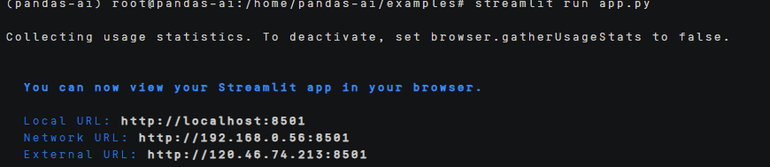
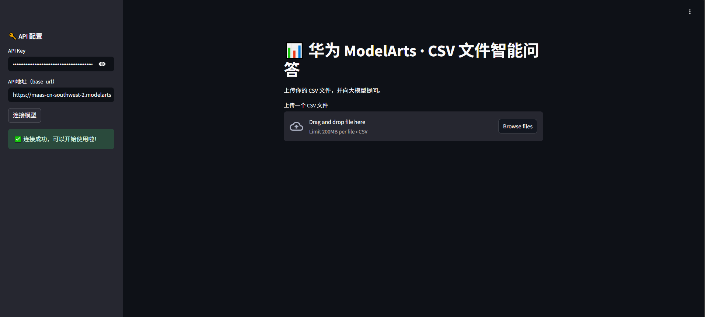
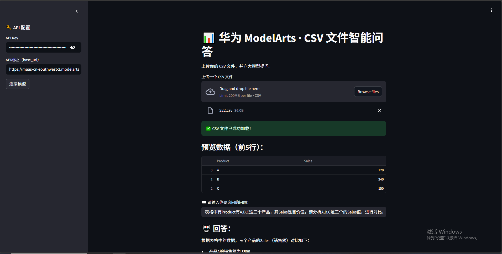

# pandas-ai部署指南


## ‌一、环境准备


### 更新系统


#### EulerOS2.0


```
yum -y update  
yum -y upgrade
```


#### Ubuntu 24.04


```
apt-get -y update
export DEBIAN_FRONTEND=noninteractive
apt-get -y -o Dpkg::Options::="--force-confold" dist-upgrade
```


## **二、安装conda**


```
mkdir -p ~/miniconda3

wget https://repo.anaconda.com/miniconda/Miniconda3-latest-Linux-aarch64.sh -O ~/miniconda3/miniconda.sh

bash ~/miniconda3/miniconda.sh -b -u -p ~/miniconda3

rm -f ~/miniconda3/miniconda.sh

source ~/miniconda3/bin/activate

conda init --all
```


创建虚拟环境

```
conda create -n pandas-ai python=3.9
```

## **三、源码下载**

### **1.下载pandas-ai的源码**

```
git clone https://github.com/sinaptik-ai/pandas-ai.git

安装依赖：

pip install "pandasai>=3.0.0b2" -i https://pypi.tuna.tsinghua.edu.cn/simple

pip install streamlit -i https://pypi.tuna.tsinghua.edu.cn/simple

pip install chardet -i https://pypi.tuna.tsinghua.edu.cn/simple

pip install lux-api -i https://pypi.tuna.tsinghua.edu.cn/simple

pip install pandas-profiling -i https://pypi.tuna.tsinghua.edu.cn/simple

pip install pydantic==2.10.2 -i https://pypi.tuna.tsinghua.edu.cn/simple

pip install transformers huggingface-hub -i https://pypi.tuna.tsinghua.edu.cn/simple

pip install --upgrade "openai>=1.3.5" -i https://pypi.tuna.tsinghua.edu.cn/simple
```


## **四、启动项目**


### **1.推理**

使用[app.py](../scripts/app.py)进行推理

Streamlit run app.py

运行之后会显示为：



然后打开网址就能进行使用了



打开网页后是首先需要填入自己的API KEY，这个是需要从华为云的modelarts studio的API Key管理中创建key获取。API地址需要替换为modelarts studio的在线推理预置服务的免费调用模型中获取。

将这两个填写之后，点击连接模型就能够进行问答了。


