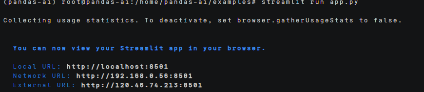

# pandas-ai智能数据分析助手使用指南

# 一、商品链接

[pandas-ai智能数据分析助手](https://marketplace.huaweicloud.com/hidden/contents/fac2ad81-404e-46ec-959c-221a692dda1d#productid=OFFI1144193316944424960)

# 二、商品说明

pandas-ai是基于人工智能的数据分析增强工具，专为使用python和pandas进行数据处理和分析的用户打造。支持上传CSV文件，进行数据分析问答，提升工作效率。系本商品通过鲲鹏服务器+EulerOS2.0进行安装部署

# 三、商品购买

您可以在云商店搜索 **pandas-ai智能数据分析助手**。

其中，地域、规格、推荐配置使用默认，购买方式根据您的需求选择按需/按月/按年，短期使用推荐按需，长期使用推荐按月/按年，确认配置后点击“立即购买”。

## 3.1 使用 RFS 模板直接部署

 
必填项填写后，点击 下一步

创建直接计划后，点击 确定

点击部署，执行计划

如下图“Apply required resource success. ”即为资源创建完成

# 3.2ECS 控制台配置

### 准备工作

在使用ECS控制台配置前，需要您提前配置好 **安全组规则**。

> **安全组规则的配置如下：**
>
> - 入方向规则放通端口8501，必须包含这些端口才能正常访问使用
> - 入方向规则放通 CloudShell 连接实例使用的端口 `22`，以便在控制台登录调试
> - 出方向规则一键放通

### 创建ECS

前提工作准备好后，选择 ECS 控制台配置跳转到[购买ECS](https://support.huaweicloud.com/qs-ecs/ecs_01_0103.html) 页面，ECS 资源的配置如下图所示：

选择CPU架构 

选择服务器规格 
选择镜像 
其他参数根据实际请客进行填写，填写完成之后，点击立即购买即可 

> **值得注意的是：**
>
> - VPC 您可以自行创建
> - 安全组选择 [**准备工作**](#准备工作) 中配置的安全组；
> - 弹性公网IP选择现在购买，推荐选择“按流量计费”，带宽大小可设置为5Mbit/s；
> - 高级配置需要在高级选项支持注入自定义数据，所以登录凭证不能选择“密码”，选择创建后设置；
> - 其余默认或按规则填写即可。

# 商品使用

## pandas-ai使用

1.启动
conda activate pandas-ai
进入对应的目录：
cd /home/pandas-ai/examples
其次运行web代码：
streamlit run app.py  
运行之后会显示：

2.使用
然后就能够在https://ip:8501网页打开应用

使用之前需要输入自己的API Key和API地址，需要从华为云的modelarts studio的API Key管理中创建key获取。API地址需要替换为modelarts studio的在线推理预置服务的免费调用模型中获取。
填写完成之后连接模型就能够连接成功了，之后就能够上传CSV进行数据分析问答了。

### 参考文档

[pandas-ai官方文档](https://github.com/sinaptik-ai/pandas-ai)
